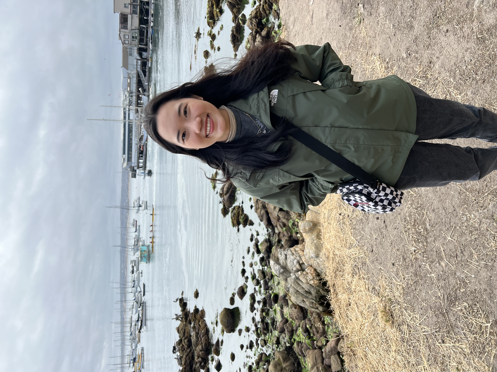

# jiawenliew.github.io

## About Me
Hi! I am a MPhil in Economics student at Singapore Management University. I am currently applying to PhD programs in Economics and I am especially keen on researching on topics related to public, family and labor economics.

  

## CV

## Writing sample

## Code sample

